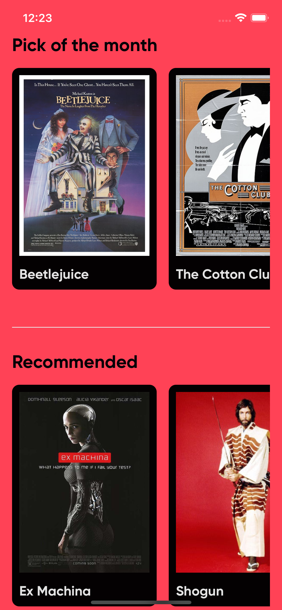

# react-native-danthony-pabon-test

Mobile app test

## About The Project

<!-- PROJECT LOGO -->
<br />
<div align="center">
  <a href="https://raw.githubusercontent.com/DanthonyPabon/react-native-danthony-pabon-test/master/screenshop/screen-shop-one.png?token=GHSAT0AAAAAABQUIRJVULQLMYYBDSMFOLKMYPJ6GYA">
    
  </a>
  <a href="https://raw.githubusercontent.com/DanthonyPabon/react-native-danthony-pabon-test/master/screenshop/screen-shop-one.png?token=GHSAT0AAAAAABQUIRJVULQLMYYBDSMFOLKMYPJ6GYA">
    
  </a>
</div>

## Requirements

- Nodev v12 LTS (see <https://nodejs.org/download/release/latest-v12.x/)>
- Homebrew (see https://brew.sh)
- watchman 4.9.0
- cocoapods 1.10.0
- xcode 13
- Java Development Kit 1.8
- Android Studio
- Android SDK Platform 30

Follow this guide <https://reactnative.dev/docs/environment-setup>

---

## Commands

### npm

`lint` run the typescript compiler and the eslint showing warnings and errors.

`ios-dev` run app on ios emulator and open it if it's not running

`pod` install ios pods dependencies

---

## Instalation and usage

### Install dependencies React Native Dependencies

You can find more documentation on: https://reactnative.dev/docs/environment-setup

1. brew install node
2. brew install watchman
3. brew install --cask adoptopenjdk/openjdk/adoptopenjdk8

### Install app dependencies

1. run `yarn` or `npm i` to install dependencies
2. run `yarn pod` or `npm run pod` to install ios dependencies. Remember to install CocoaPods first, `sudo gem install cocoapods`.
3. configure env file if necesary

### run manually

2. `yarn android` (or npm run ios/android) to launch the app. Keep in mind that you have to launch android emulator manually

### run with vscode (automatically)

1. Install [react native tools](https://marketplace.visualstudio.com/items?itemName=msjsdiag.vscode-react-native)
2. run debug android (with emulator open or mobile connected) or debug ios

### Build with XCode

#### React-Native Install

Dependencies

- nvm
- xcode

Make sure an apropriate env file is present at the root, see CI/CD for how the production env file is generated.

**Example .development.env file**

```
DEVAPI_URL=https://raw.githubusercontent.com
```

## Troubleshoots

1. Sometimes on android for compile you need to add this to your gradle.properties file "org.gradle.java.home=/Applications/Android Studio.app/Contents/jre/jdk/Contents/Home"

### Branches notes

### Branches

- master - production
- develop - latest unstable changes
- feature/\* - feature branch. This branches are created from develop to add a new feature. To integrate the feature, you should create a pull request to develop.
- bugfix/\* - bugfix branch. This branches are created from develop to fix a bug. To integrate the fix, you should create a pull request to develop.
- hotfix/\* - hotfix branch. This branches are created from master to fix a production bug. To integrate the fix, you should create a pull request to master and develop.

### Pre commit

1. `yarn format` before committing (always do it before committing)

